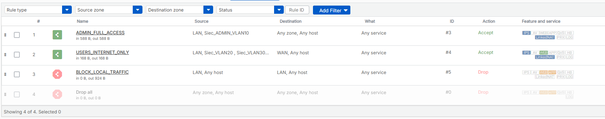
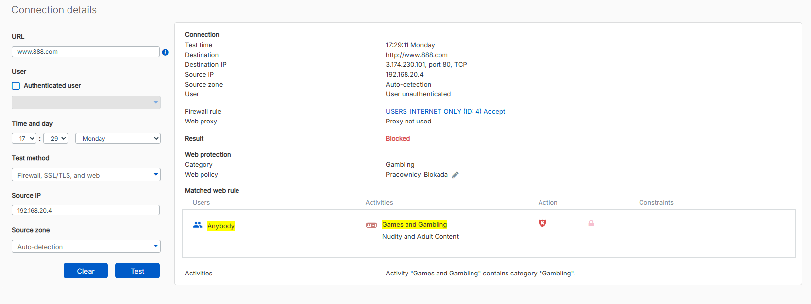
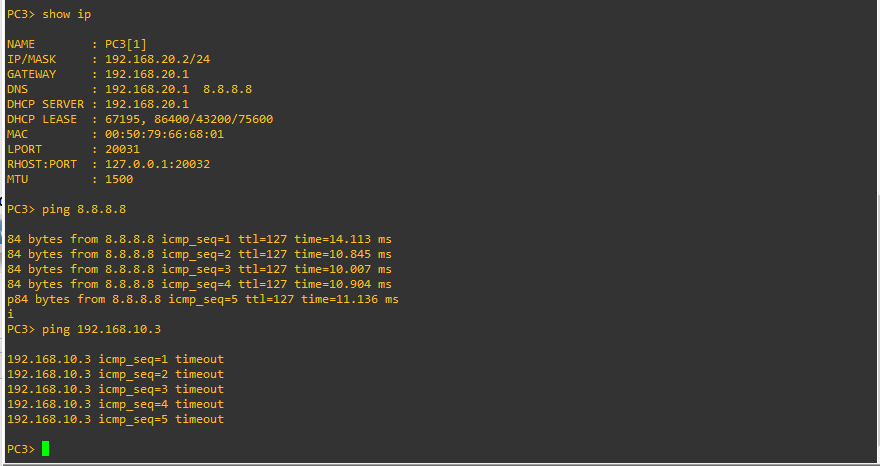
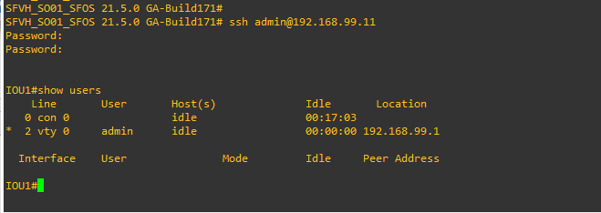

# Symulacja Sieci LAN: (Sophos & Cisco)

## 1. Architektura Sieciowa

Projekt zakłada budowę bezpiecznej sieci korporacyjnej z wykorzystaniem firewalla nowej generacji (NGFW) oraz przełączników Cisco. Firewall pełni funkcję głównej bramy sieciowej oraz realizuje routing między sieciami wirtualnymi w topologii **Router-on-a-Stick**.

  
   
  <em>Topologia logiczna w środowisku GNS3. Centralnym punktem jest Sophos, obsługujący ruch z warstwy dystrybucji (IOU2) i dostępu (IOU1, IOU3).</em>

    
    
    
    

**Konfiguracja interfejsów Firewalla:**

- **Port 1 (LAN):** Dostęp zarządzający (Management Access).
- **Port 2 (WAN):** Wyjście do Internetu (Klient DHCP, NAT).
- **Port 3 (Trunk):** Łącze trunkingowe 802.1Q obsługujące VLANy: 10, 20, 30, 99.

---

### 1.1. Plan Adresacji

Poniższa tabela przedstawia podział sieci na wirtualne sieci LAN (VLAN). Hosty są rozproszone fizycznie na różnych przełącznikach, ale komunikują się w ramach swoich dedykowanych podsieci.

| VLAN ID | Kolor (Rys. 1) | Adres Sieci (CIDR)  | Brama (Gateway) | Przypisane Hosty |
| :------ | :------------- | :------------------ | :-------------- | :--------------- |
| **10**  | Czerwony       | **192.168.10.0/24** | `192.168.10.1`  | **PC2, PC4**     |
| **20**  | Niebieski      | **192.168.20.0/24** | `192.168.20.1`  | **PC3, PC5**     |
| **30**  | Zielony        | **192.168.30.0/24** | `192.168.30.1`  | **PC6, PC7**     |
| **99**  | -              | **192.168.99.0/24** | `192.168.99.1`  | _Switch SVI_     |

---

## 2. Reguły Firewall i Polityki Dostępu

Kluczowym elementem zabezpieczenia sieci jest ścisła kontrola przepływu pakietów między strefami.

  
   
  <em>Polityki bezpieczeństwa na urządzeniu Sophos XG. Widoczna separacja ruchu administracyjnego od ruchu użytkowników.</em>

**Szczegółowy opis reguł:**

| ID          | Nazwa Reguły            | Źródło (Zone/Net) | Cel (Zone/Net) | Akcja      | Opis Funkcjonalny                                                                        |
| :---------- | :---------------------- | :---------------- | :------------- | :--------- | :--------------------------------------------------------------------------------------- |
| **#1**      | **ADMIN_FULL_ACCESS**   | LAN (VLAN 10)     | WAN (Any)      | **ACCEPT** | Nielimitowany dostęp do Internetu.                                                       |
| **#2**      | **USERS_INTERNET_ONLY** | LAN (VLAN 20/30)  | WAN (Any)      | **ACCEPT** | Dostęp pracowniczy z włączonym filtrowaniem stron (Web Filter) i IPS.                    |
| **#3**      | **BLOCK_LOCAL_TRAFFIC** | LAN (Any)         | LAN (Any)      | **DROP**   | **Izolacja sieci:** Blokada komunikacji między VLAN-ami (np. VLAN 20 nie widzi VLAN 30). |
| **Default** | **Drop all**            | Any               | Any            | **DROP**   | Reguła "Clean-up" blokująca każdy inny ruch.                                             |

---

## 3. Funkcje Bezpieczeństwa Next-Gen

### 3.1. Web Filtering

W regule `#2 USERS_INTERNET_ONLY` zaimplementowano politykę `Pracownicy_Blokada`, która ma na celu zwiększenie produktywności i bezpieczeństwa.

**Skonfigurowane ograniczenia:**

- **Kategorie zablokowane:** _Games and Gambling_, _Nudity and Adult Content_.
- **Ochrona:** _Scan HTTP and decrypted HTTPS_ (Głęboka inspekcja SSL).

  
   
  <em>Symulator polityki (Policy Test). Próba dostępu do domeny hazardowej (www.888.com) przez użytkownika z sieci 192.168.20.4 kończy się blokadą (Action: Blocked).</em>

---

## 4. Weryfikacja Skuteczności

Przeprowadzono testy łączności z poziomu stacji końcowej (VPC), aby potwierdzić działanie reguł firewall oraz poprawność adresacji.

  
   
  <em>Weryfikacja w terminalu PC3 (VLAN 20).</em>

**Analiza wyników PC3:**

1.  **Internet działa:** `ping 8.8.8.8` -> **Sukces** (Reguła #2 pozwala na wyjście).
2.  **Izolacja działa:** `ping 192.168.10.3` -> **Timeout** (Reguła #3 poprawnie blokuje ruch do innej podsieci lokalnej).
3.  **Adresacja:** PC3 poprawnie otrzymał adres z puli DHCP (192.168.20.2).

---

## 5. Zarządzanie Infrastrukturą

Do zarządzania przełącznikami wydzielono dedykowany **VLAN 99**.

### 5.1. Bezpieczny Dostęp SSH

Na przełącznikach Cisco wyłączono protokół Telnet na rzecz szyfrowanego SSH v2.

  
   
  <em>Pomyślne logowanie przez SSH do przełącznika IOU1 (192.168.99.11) z poziomu konsoli Sophos.</em>

---

## 6. Zabezpieczenia Warstwy 2

Na switchach dostępowych (`IOU1`, `IOU3`) wdrożono dodatkowe mechanizmy ochronne:

- **Port Security:** Ochrona przed podpięciem nieautoryzowanych urządzeń (Sticky MAC).
- **VLAN Pruning:** Na portach Trunk przepuszczane są tylko niezbędne VLANy (10, 20, 30, 99), co minimalizuje wektory ataku.
- **BPDU Guard:** Ochrona przed pętlami STP wywołanymi przez użytkowników.
